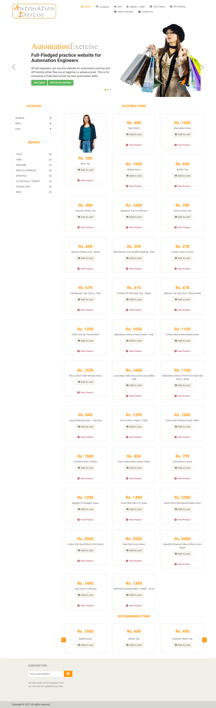
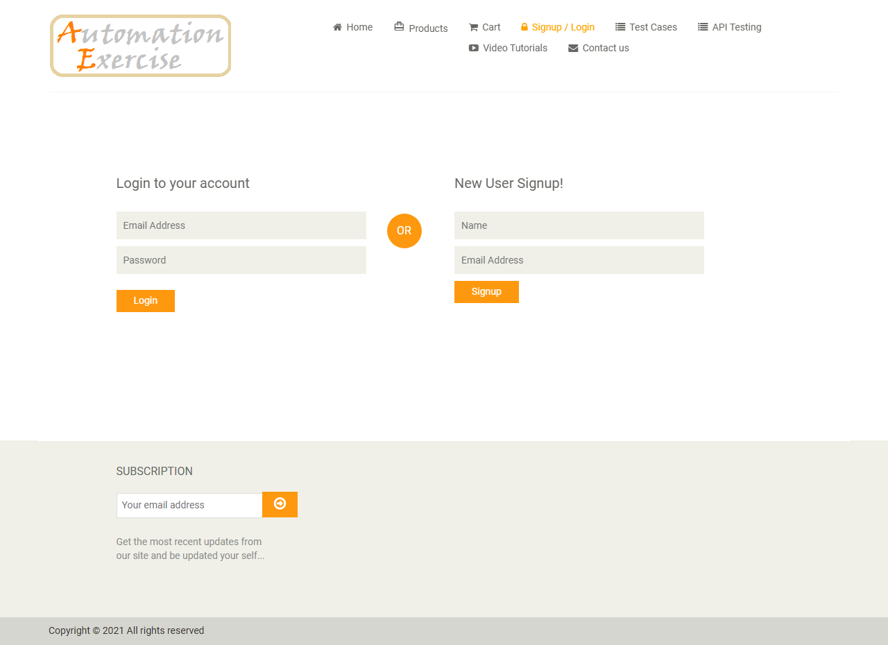
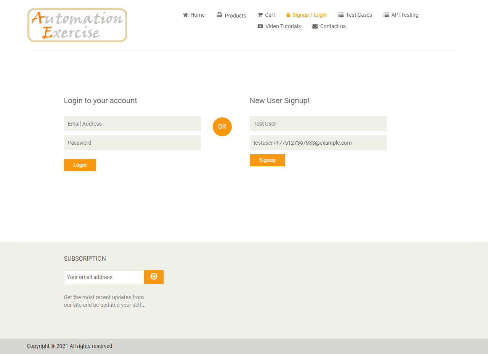
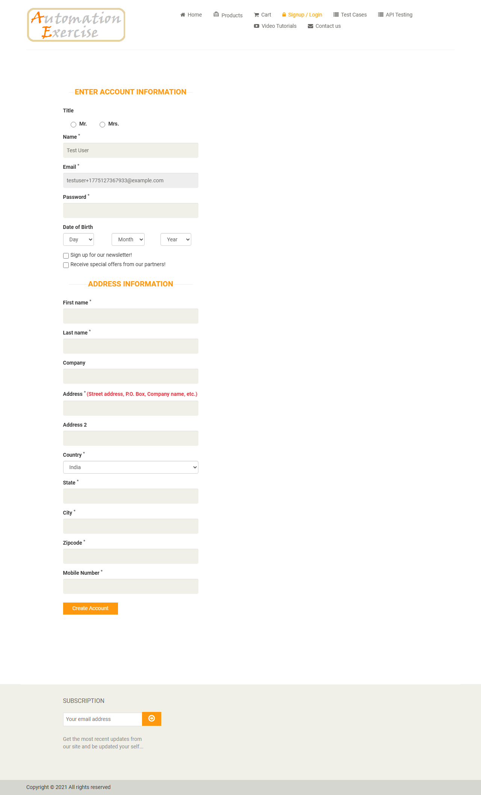
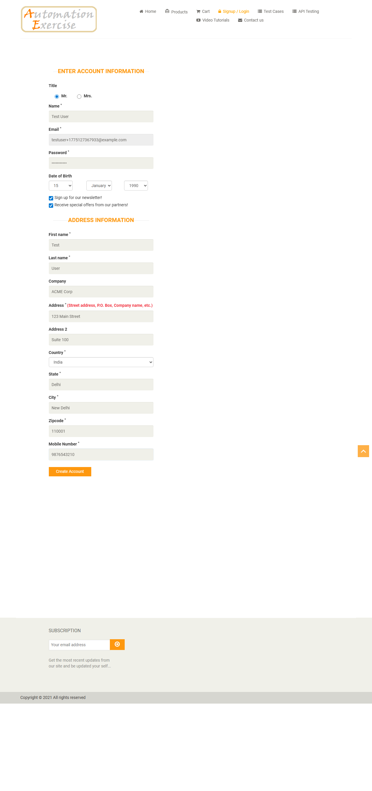
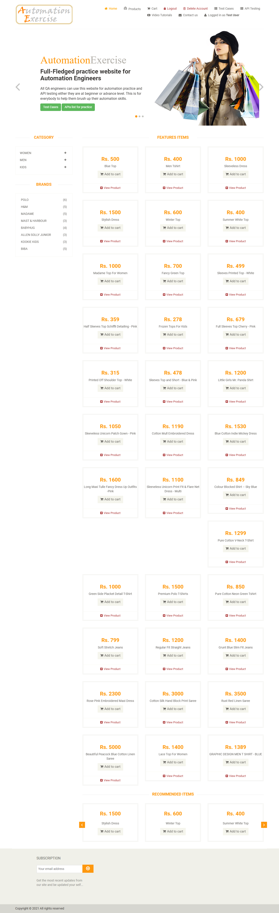

# Test Results 1

- **Scenario:** Register a new user on automationexercise.com and verify account creation, login status, and account deletion.
- **Steps Taken:**
  1. Launch browser
  2. Navigate to URL `https://automationexercise.com`
  3. Verify that home page is visible successfully
  4. Click on `Signup / Login` button
  5. Verify `New User Signup!` is visible
  6. Enter name and email address
  7. Click `Signup` button
  8. Verify that `ENTER ACCOUNT INFORMATION` is visible
  9. Fill details: Title, Name, Email, Password, Date of birth
  10. Select checkbox `Sign up for our newsletter!`
  11. Select checkbox `Receive special offers from our partners!`
  12. Fill details: First name, Last name, Company, Address, Address2, Country, State, City, Zipcode, Mobile Number
  13. Click `Create Account` button
  14. Verify that `ACCOUNT CREATED!` is visible
  15. Click `Continue` button
  16. Verify that `Logged in as username` is visible
  17. Click `Delete Account` button
  18. Verify that `ACCOUNT DELETED!` is visible
- **Outcome:**
  The registration flow completed successfully. The user was able to sign up, confirm account creation, return to the logged-in state, and then delete the account.
- **Issues Found:**
  - No issues encountered.

## Evidence

### Step 1

### Step 2

### Step 3

### Step 4

### Step 5

### Step 6

### Step 7

### Step 8

