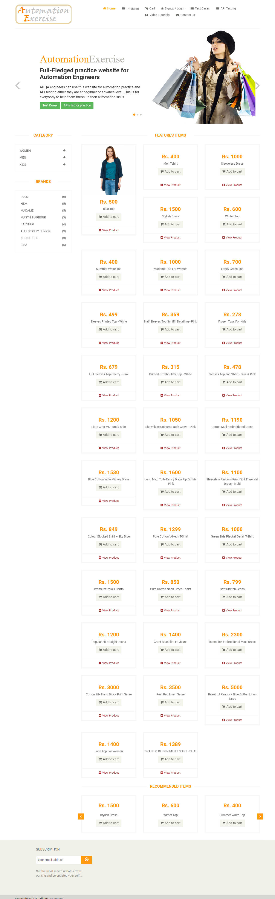
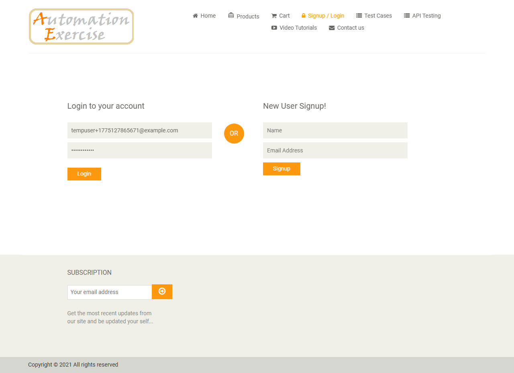
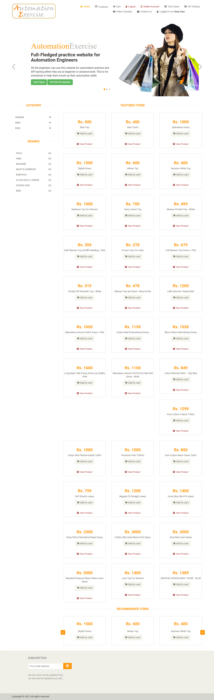
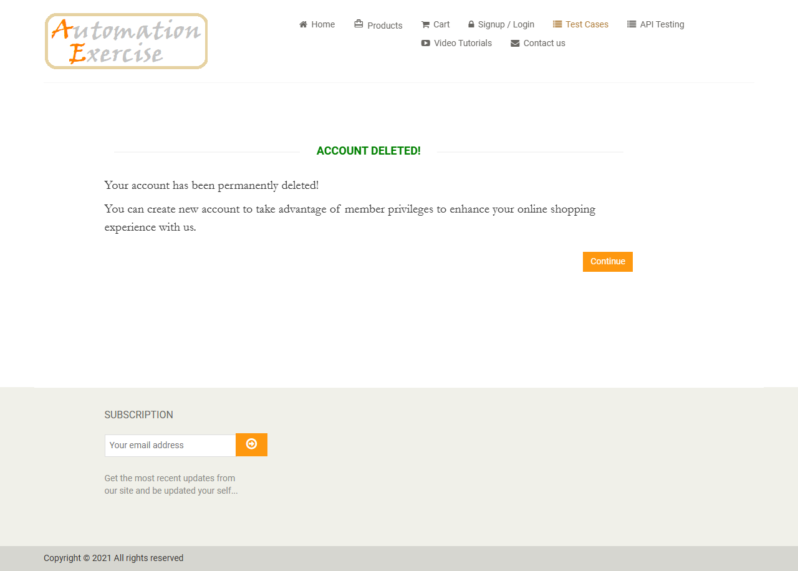

# Test Results 2

- **Scenario:** Login with correct email and password on automationexercise.com and delete the account.
- **Steps Taken:**
  1. Launch browser
  2. Navigate to URL `https://automationexercise.com`
  3. Verify that home page is visible successfully
  4. Click on `Signup / Login` button
  5. Verify `Login to your account` is visible
  6. Enter correct email address and password
  7. Click `login` button
  8. Verify that `Logged in as username` is visible
  9. Click `Delete Account` button
  10. Verify that `ACCOUNT DELETED!` is visible
- **Outcome:**
  The login flow completed successfully with valid credentials. The user was logged in and then deleted the account without issues.
- **Issues Found:**
  - No issues encountered during execution.

## Evidence

### Step 1

### Step 2

### Step 3

### Step 4

### Step 5

