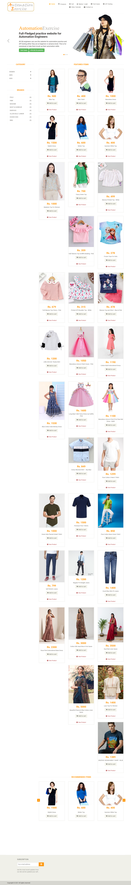
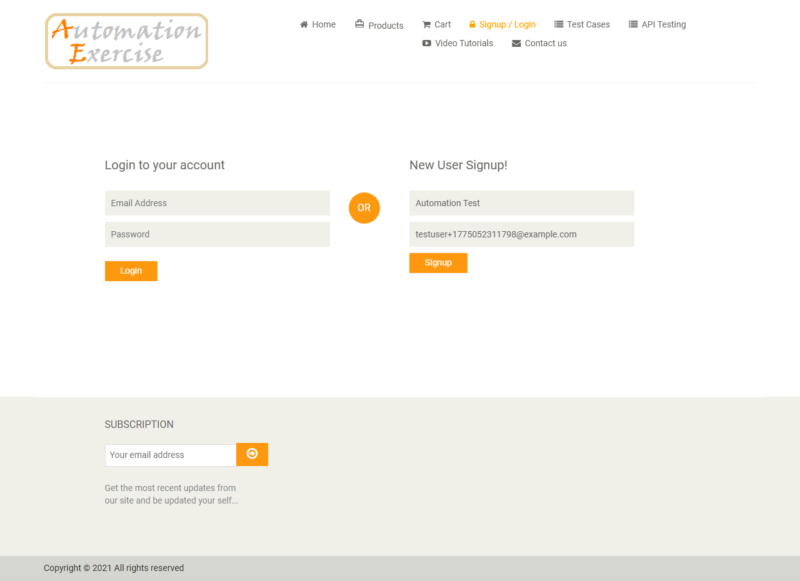
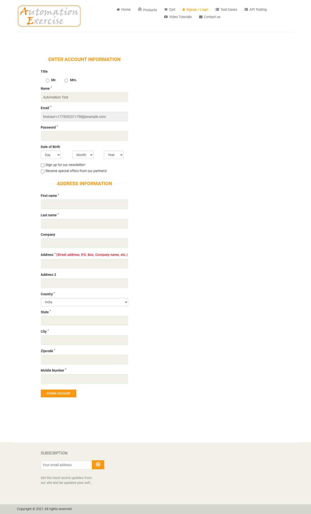
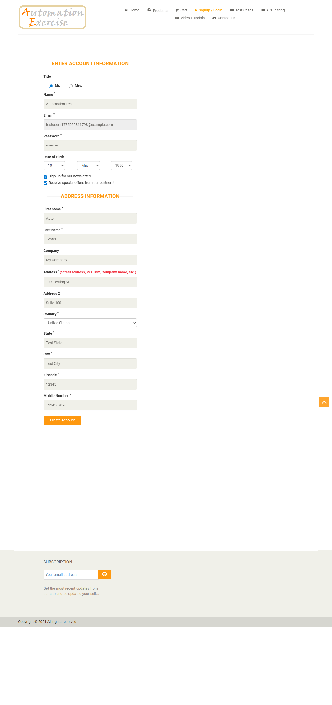
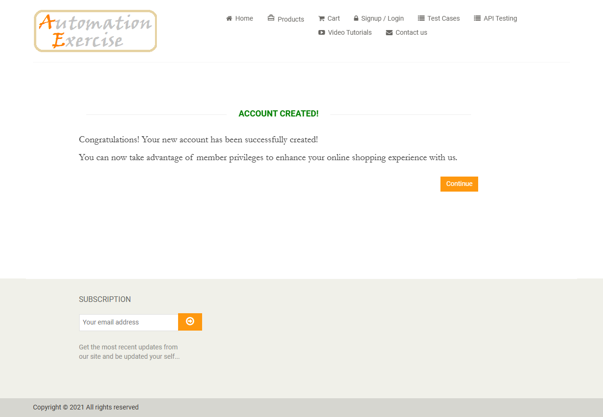
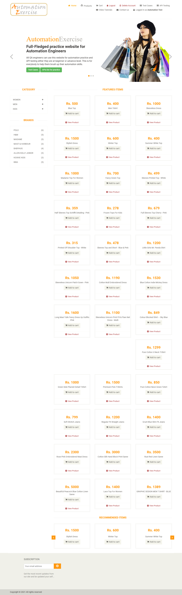
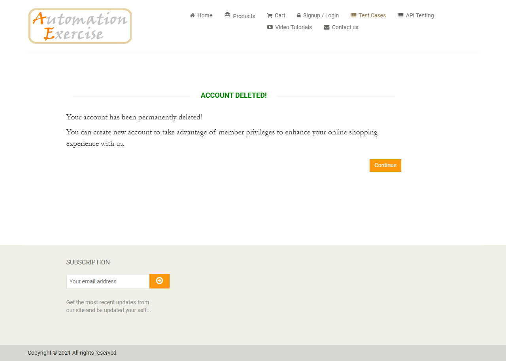

# Test Case 1 - Register User

This document captures each step of Test Case 1 using the screenshots saved in this folder.

## Step 1
- Verify home page is visible successfully

## Step 2
- Click on 'Signup / Login' button

## Step 3
- Enter name and email address
- Click 'Signup' button

## Step 4
- Verify that 'ENTER ACCOUNT INFORMATION' is visible

## Step 5
- Fill details: Title, Name, Email, Password, Date of birth
- Select checkbox 'Sign up for our newsletter!'
- Select checkbox 'Receive special offers from our partners!'
- Fill details: First name, Last name, Company, Address, Address2, Country, State, City, Zipcode, Mobile Number
- Click 'Create Account' button

## Step 6
- Verify that 'ACCOUNT CREATED!' is visible

## Step 7
- Click 'Continue' button
- Verify that 'Logged in as username' is visible

## Step 8
- Click 'Delete Account' button
- Verify that 'ACCOUNT DELETED!' is visible and click 'Continue' button

